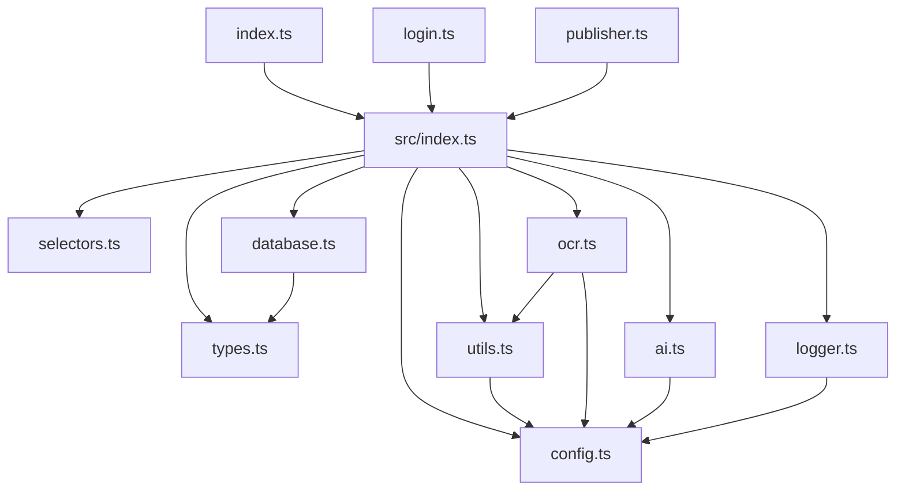

# 🏗️ XHS Automation 项目架构文档

> v5.0 Ultimate Edition - 模块化重构版
> 
> 本文档描述项目的技术架构、模块组织、数据流程和开发规范。

---

## 📦 项目结构

```
xhs_automation/
├── src/                      # 🎯 核心模块库
│   ├── config.ts            # 配置常量（路径、API、安全参数）
│   ├── types.ts             # TypeScript 类型定义
│   ├── selectors.ts         # DOM 选择器集合
│   ├── utils.ts             # 通用工具函数
│   ├── ocr.ts               # OCR 图片识别
│   ├── ai.ts                # AI 智能分析
│   ├── database.ts          # 数据库操作（JSON）
│   ├── logger.ts            # 日志系统
│   └── index.ts             # 统一导出接口
│
├── content/                  # 📝 内容管理
│   ├── drafts/              # 待发布内容
│   └── published/           # 已发布归档
│
├── data/                     # 💾 数据存储
│   └── interview_questions.json
│
├── reports/                  # 📊 日报输出
│   └── daily_trends.md
│
├── index.ts                  # 🔍 情报搜集主程序
├── login.ts                  # 🔐 登录工具
├── publisher.ts              # 🚀 发布工具
├── test_all.ts               # 🧪 测试套件
│
├── .env                      # 🔑 环境变量（不提交）
├── .env.example              # 📋 环境变量模板
├── xhs_cookies.json          # 🍪 登录凭证（不提交）
└── package.json              # 📦 项目配置
```

---

## 🏛️ 架构设计

### 分层架构

```
┌──────────────────────────────────────┐
│         Application Layer            │
│   (index.ts, login.ts, publisher.ts) │
├──────────────────────────────────────┤
│          Module Layer                │
│              (src/)                  │
├──────────────────────────────────────┤
│         External Services            │
│    (Puppeteer, Tesseract, AI API)   │
└──────────────────────────────────────┘
```

### 模块依赖关系



---

## 🔄 数据流

### 1. 情报搜集流程

```
用户执行 index.ts
    ↓
加载 Cookies 登录态
    ↓
生成关键词组合 (getSmartMixKeywords)
    ↓
循环搜索关键词
    ├─> 搜索结果页
    ├─> 点击进入详情
    ├─> 提取正文内容
    ├─> OCR 识别图片（可选）
    ├─> 提取评论
    └─> 保存到数据库
    ↓
生成 AI 分析报告
    ↓
输出 daily_trends.md
```

### 2. 发布流程

```
用户执行 publisher.ts
    ↓
扫描 drafts/ 目录
    ↓
解析 Markdown 文件
    ↓
登录创作者中心
    ↓
上传图片
    ↓
填写标题和内容
    ↓
发布笔记
    ↓
归档到 published/
```

---

## 🧩 核心模块说明

### config.ts - 配置管理
```typescript
// 主要功能
- PROJECT_ROOT: 动态项目路径
- AI_CONFIG: API 配置（支持环境变量）
- SAFETY_CONFIG: 安全参数（延时、间隔）
- KEYWORD_POOLS: 专家词库
- getSmartMixKeywords(): 智能关键词轮询
```

### types.ts - 类型定义
```typescript
// 核心类型
- NoteInfo: 笔记信息
- CommentInfo: 评论信息
- QuestionItem: 题库条目
- Draft: 草稿内容
- SaveResult: 保存结果
```

### selectors.ts - DOM 选择器
```typescript
// 选择器集合
- LOGIN_CHECK_SELECTORS: 登录检测
- DETAIL_SELECTORS: 详情页元素
- NOTE_SELECTORS: 笔记列表
- PUBLISH_SELECTORS: 发布页面
```

### utils.ts - 工具函数
```typescript
// 通用功能
- delay/randomDelay: 延时控制
- humanClick/humanScroll: 拟人化操作
- loadCookies: Cookie 管理
- makeSearchURL: URL 构造
- extractNoteId: ID 提取
```

### ocr.ts - OCR 识别
```typescript
// 图片文字识别
- extractTextFromImage: 单图 OCR
- extractOCRFromImages: 批量 OCR
- humanViewImages: 拟人化看图
- 10 秒超时保护
- 支持中英文识别
```

### ai.ts - AI 分析
```typescript
// 智能分析
- callAI: 通用 AI 调用
- generateAIReport: 生成日报
- 支持多次重试
- API Key 配置检查
```

### database.ts - 数据存储
```typescript
// JSON 数据库
- noteToQuestionItem: 数据转换
- saveToDatabase: 增量保存
- 自动去重（基于 noteId）
- 目录自动创建
```

### logger.ts - 日志系统
```typescript
// 日志管理
- 四级日志：ERROR, WARN, INFO, DEBUG
- 环境变量控制：LOG_LEVEL
- 时间戳 + 模块前缀
```

---

## 🔧 开发规范

### 1. 模块化原则
- **单一职责**: 每个模块只负责一个功能域
- **高内聚低耦合**: 模块间通过接口通信
- **依赖倒置**: 上层依赖抽象，不依赖具体实现

### 2. 错误处理
```typescript
// ✅ 好的实践
try {
  await riskyOperation();
} catch (error) {
  logger.error('操作失败', error);
  // 具体的错误恢复逻辑
}

// ❌ 避免空 catch
try {
  await riskyOperation();
} catch {} // 不要这样做！
```

### 3. 类型安全
```typescript
// ✅ 使用明确类型
function process(note: NoteInfo): QuestionItem | null

// ❌ 避免 any
function process(note: any): any
```

### 4. 异步控制
```typescript
// ✅ 使用 async/await
const result = await fetchData();

// ✅ 并发优化
const results = await Promise.all([
  fetchA(),
  fetchB(),
  fetchC()
]);
```

### 5. 配置管理
```typescript
// ✅ 环境变量优先
const apiKey = process.env.API_KEY || '';

// ❌ 避免硬编码
const apiKey = 'sk-xxx...'; // 绝不要这样！
```

---

## 🚀 扩展指南

### 添加新模块

1. **创建模块文件**
```typescript
// src/newFeature.ts
export function newFeature() {
  // 实现
}
```

2. **添加到统一导出**
```typescript
// src/index.ts
export * from './newFeature';
```

3. **编写测试**
```typescript
// test_all.ts
test('newFeature 正常工作', () => {
  const result = newFeature();
  return result === expected;
});
```

### 添加新的选择器

1. **定义选择器**
```typescript
// src/selectors.ts
export const NEW_SELECTORS = {
  ELEMENT: 'div.new-element',
  BUTTON: 'button[data-new]'
};
```

2. **使用选择器**
```typescript
// index.ts
import { NEW_SELECTORS } from './src';
const element = await page.$(NEW_SELECTORS.ELEMENT);
```

### 添加新的配置

1. **定义配置**
```typescript
// src/config.ts
export const NEW_CONFIG = {
  FEATURE_ENABLED: process.env.NEW_FEATURE === 'true',
  LIMIT: parseInt(process.env.NEW_LIMIT || '10')
};
```

2. **更新 .env.example**
```bash
# .env.example
NEW_FEATURE=true
NEW_LIMIT=20
```

---

## 🧪 测试策略

### 单元测试
- 每个模块的核心功能
- 类型转换和数据处理
- 工具函数

### 集成测试
- 模块间交互
- 文件 I/O 操作
- API 调用

### 运行测试
```bash
# 完整测试套件
npx tsx test_all.ts

# 特定功能测试
npx tsx test_v5_features.ts
```

---

## 📈 性能优化

### 1. 并发控制
```typescript
// OCR 并发处理
const ocrResults = await Promise.all(
  images.slice(0, 3).map(img => extractTextFromImage(img))
);
```

### 2. 缓存策略
```typescript
// 选择器缓存
const cache = new Map();
if (cache.has(key)) return cache.get(key);
```

### 3. 资源清理
```typescript
// 确保浏览器关闭
try {
  await main();
} finally {
  await browser?.close();
}
```

---

## 🔐 安全考虑

### 1. 敏感信息
- **API Keys**: 只通过环境变量
- **Cookies**: 加入 .gitignore
- **个人信息**: 不硬编码

### 2. 反爬虫策略
- **User Agent**: Puppeteer Stealth
- **延时策略**: 随机间隔
- **拟人操作**: 贝塞尔曲线鼠标轨迹

### 3. 错误恢复
- **超时保护**: OCR 10秒超时
- **重试机制**: AI 调用 2次重试
- **降级方案**: AI 失败时返回基础报告

---

## 📚 相关文档

- [README.md](README.md) - 使用说明
- [SOP.md](SOP.md) - 每日运营手册
- [PLAN_FINAL.md](PLAN_FINAL.md) - 项目白皮书

---

## 🔄 版本历史

- **v5.0** - 模块化重构 + OCR + AI 分析
- **v4.0** - 数据库 + 社区洞察
- **v3.0** - 点击模式 + 去重
- **v2.0** - 发布系统
- **v1.0** - 基础爬虫

---

**Last Updated**: 2024-12-02
